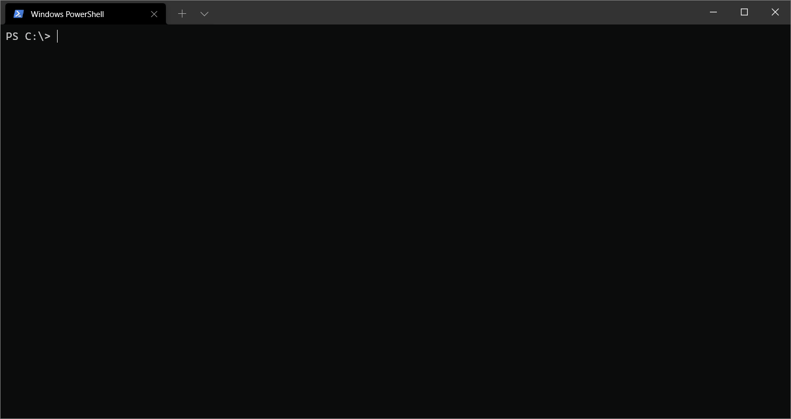
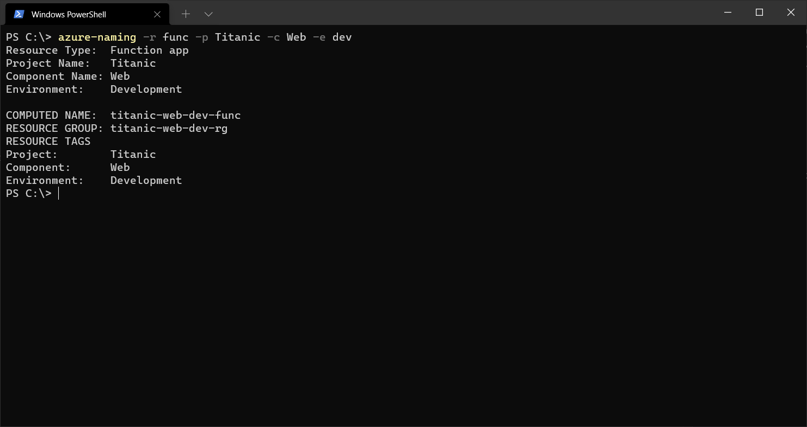
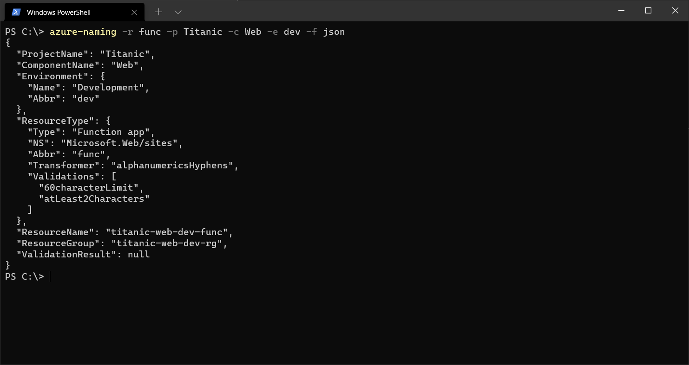
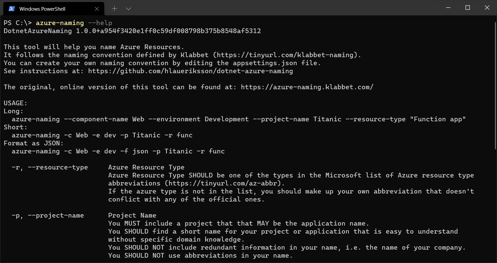

# ☁️✍️ Azure Naming

This is a `dotnet` tool helping you to name Azure Resources.

> It is a fork of:
>
> - https://github.com/klabbet/azure-naming
>
> The original, online version of this tool:
>
> - https://azure-naming.klabbet.com/

This tool is based on Klabbet naming convention:

- https://github.com/klabbet/azure-naming

It uses the *abbreviations* of Azure resources recommended by Microsoft:

- https://docs.microsoft.com/en-us/azure/cloud-adoption-framework/ready/azure-best-practices/resource-abbreviations

## Installation

Install:

```cmd
dotnet tool install -g dotnet-azure-naming
```

Update:

```cmd
dotnet tool update -g dotnet-azure-naming
```

Uninstall:

```cmd
dotnet tool uninstall -g dotnet-azure-naming
```

## Usage

Without arguments / Interactive:

```cmd
azure-naming
```



- Start typing to filter Resource Types
- Use ⬅️ and ➡️ keys to turn pages
- Use ⬆️ and ⬇️ keys to select
- Use `Enter` key to confirm

With arguments:

```cmd
azure-naming --resource-type "Function app" --project-name Titanic --component-name Web --environment Development
```

Short:

```cmd
azure-naming -r func -p Titanic -c Web -e dev
```



Format as JSON:

```cmd
azure-naming -r func -p Titanic -c Web -e dev -f json
```



Help:

```cmd
azure-naming --help
```



## Create your own naming convention

Microsoft offers best-practices when defining your naming convention:

- https://docs.microsoft.com/en-us/azure/cloud-adoption-framework/ready/azure-best-practices/resource-naming

Naming rules and restrictions:

- https://docs.microsoft.com/en-us/azure/azure-resource-manager/management/resource-name-rules

Find out where `dotnet-azure-naming` is installed:

```cmd
azure-naming --settings
```

The output will include the location:

```cmd
"Location": "C:/Users/<user>/.dotnet/tools/.store/dotnet-azure-naming/1.0.0/dotnet-azure-naming/1.0.0/tools/net6.0/any"
```

Edit the `appsettings.json` file in above location:

```json
{
  "DotnetAzureNamingSettings": {
    "AzureResourceTypesPath": "azure-resource-types.csv",
    "Environments": [
      {
        "Name": "Development",
        "Abbr": "dev"
      },
      {
        "Name": "Test",
        "Abbr": "test"
      },
      {
        "Name": "Staging",
        "Abbr": "stage"
      },
      {
        "Name": "Production",
        "Abbr": "prod"
      }
    ],
    "ResourceNameFormat": "{projectName} {componentName} {environment} {resourceType}",
    "ResourceGroupFormat": "{projectName} {componentName} {environment} rg"
  }
}
```

You may:

- Change the path to `AzureResourceTypesPath`
- Define your own `Environments`
- Change the formats in `ResourceNameFormat` and `ResourceGroupFormat`

If you wish to change the [default](https://docs.microsoft.com/en-us/azure/cloud-adoption-framework/ready/azure-best-practices/resource-abbreviations) abbreviations of Azure resource types, edit the `azure-resource-types.csv` file:

```csv
Asset type;Resource provider namespace/Entity;Abbreviation;Transformer;Validator1;Validator2;Validator3;Validator4
AKS cluster;Microsoft.ContainerService/managedClusters;aks;alphanumericsUnderscoresHyphens;startWithAlphanumeric;endWithAlphanumeric;63characterLimit;
App Configuration store;Microsoft.AppConfiguration/configurationStores;appcs;alphanumericsUnderscoresHyphens;startWithAlphanumeric;endWithAlphanumeric;50characterLimit;atLeast5Characters
App Service environment;Microsoft.Web/sites;ase;alphanumericsHyphens;;;60characterLimit;atLeast2Characters
App Service plan;Microsoft.Web/serverFarms;plan;alphanumericsUnderscoresPeriodsHyphens;startWithAlphanumeric;endWithAlphanumericOrUnderscore;80characterLimit;
...
```

Open the file in a Spreadsheet Editor and make changes in the Abbreviation (*third*) column.

The original version of `azure-resource-types.csv` is located in Klabbets GitHub repo:

- https://github.com/klabbet/azure-naming/blob/main/scripts/azure-resource-types.csv

Changes made to `appsettings.json` and `azure-resource-types.csv` may be lost when updating `dotnet-azure-naming`.
Make sure to take backups!

You can also make use of Environment Variables to configure the naming convention.

Set Environment Variables via the terminal:

```cmd
setx DotnetAzureNamingSettings:AzureResourceTypesPath "c:\work\azure-resource-types.csv"
setx DotnetAzureNamingSettings:Environments:0:Name "Pre-Production"
setx DotnetAzureNamingSettings:Environments:0:Abbr "preprod"
setx DotnetAzureNamingSettings:Environments:1:Name "Production"
setx DotnetAzureNamingSettings:Environments:1:Abbr "prod"
setx DotnetAzureNamingSettings:Environments:2:Name " "
setx DotnetAzureNamingSettings:Environments:2:Abbr " "
setx DotnetAzureNamingSettings:Environments:3:Name " "
setx DotnetAzureNamingSettings:Environments:3:Abbr " "
setx DotnetAzureNamingSettings:ResourceNameFormat "prefix {projectName} {componentName} {environment} {resourceType} suffix"
setx DotnetAzureNamingSettings:ResourceGroupFormat "prefix {projectName} {componentName} {environment} rg suffix"
```

These settings will be preserved after an update of the tool.
