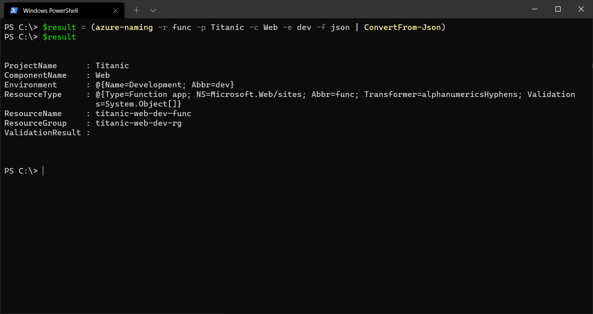

# ☁️✍️ Azure Naming

[](https://github.com/hlaueriksson/dotnet-azure-naming/actions/workflows/build.yml)

This is a `dotnet` tool helping you to name Azure Resources.

> It is a fork of:
>
> - https://github.com/klabbet/azure-naming
>
> The original, online version of this tool:
>
> - https://azure-naming.klabbet.com/

This tool is based on Klabbet naming convention:

- https://github.com/klabbet/azure-naming

It uses the *abbreviations* of Azure resources recommended by Microsoft:

- https://docs.microsoft.com/en-us/azure/cloud-adoption-framework/ready/azure-best-practices/resource-abbreviations

## Installation

Install:

```cmd
dotnet tool install -g dotnet-azure-naming
```

Update:

```cmd
dotnet tool update -g dotnet-azure-naming
```

Uninstall:

```cmd
dotnet tool uninstall -g dotnet-azure-naming
```

## Usage

Without arguments / Interactive:

```cmd
azure-naming
```


- Start typing to filter Resource Types
- Use ⬅️ and ➡️ keys to turn pages
- Use ⬆️ and ⬇️ keys to select
- Use `Enter` key to confirm

With arguments:

```cmd
azure-naming --resource-type "Function app" --project-name Titanic --component-name Web --environment Development
```

Short:

```cmd
azure-naming -r func -p Titanic -c Web -e dev
```


Format as JSON:

```cmd
azure-naming -r func -p Titanic -c Web -e dev -f json
```


PowerShell:

```ps1
$result = (azure-naming -r func -p Titanic -c Web -e dev -f json | ConvertFrom-Json)
```



Help:

```cmd
azure-naming --help
```


Arguments:

- `resource-type`, required

  <details>
    <summary>Azure Resource Type</summary>

  Azure Resource Type **SHOULD** be one of the types in the [Microsoft list of Azure resource type abbreviations](https://docs.microsoft.com/en-us/azure/cloud-adoption-framework/ready/azure-best-practices/resource-abbreviations).

  If the azure type is not in the list, you should make up your own abbreviation that doesn't conflict with any of the official ones.

  Must match one of the values of `Asset type` or `Abbreviation` from `azure-resource-types.csv`.
  </details>

- `project-name`, required

  <details>
    <summary>Project Name</summary>

  You **MUST** include a project that MAY be the application name.

  You **SHOULD** find a short name for your project or application that is easy to understand without specific domain knowledge.

  You **SHOULD NOT** include redundant information in your name, i.e. the name of your company.

  You **SHOULD NOT** use abbreviations in your name.
  </details>

- `component-name`

  <details>
    <summary>Component Name</summary>

  You **SHOULD** include a component name if your project or application consists of several components. Examples of components are web, api, service.

  You **SHOULD NOT** use resource type as component name, i.e. database, function, insights, vm.

  You **MAY** omit the component name if the project name is sufficient.
  </details>

- `environment`

  <details>
    <summary>Environment</summary>

  You **MUST** use the correct environment specifier for your environment.

  | Specifier | Environment |
  | --------- | ----------- |
  | dev       | Development |
  | test      | Test        |
  | stage     | Staging     |
  | prod      | Production  |

  You **MAY** add custom environment specifiers to your naming convention.

  Defaults to `Development`.
  </details>

## Azure CLI

Use `azure-naming` together with [Azure CLI](https://docs.microsoft.com/en-us/azure/app-service/scripts/cli-deploy-github) to create a web app and deploy code from GitHub:

```ps1
# Get the resource name
$result = (azure-naming -r app -p Titanic$(Get-Random) -c Web -e dev -f json | ConvertFrom-Json)

# Replace the following URL with a public GitHub repo URL
$gitrepo = "https://github.com/Azure-Samples/app-service-web-dotnet-get-started.git"

# Create a resource group
az group create --location westeurope --name $result.ResourceGroup

# Create an App Service plan in FREE tier
az appservice plan create --name $result.ResourceName --resource-group $result.ResourceGroup --sku FREE

# Create a web app
az webapp create --name $result.ResourceName --resource-group $result.ResourceGroup --plan $result.ResourceName

# Deploy code from a public GitHub repository
az webapp deployment source config --name $result.ResourceName --resource-group $result.ResourceGroup --repo-url $gitrepo --branch master --manual-integration

# Copy the result of the following command into a browser to see the web app
echo "https://$($result.ResourceName).azurewebsites.net"
```

## Azure PowerShell

Use `azure-naming` together with [Azure PowerShell](https://docs.microsoft.com/en-us/azure/app-service/scripts/powershell-deploy-github) to create a web app and deploy code from GitHub:

```ps1
# Get the resource name
$result = (azure-naming -r app -p Titanic$(Get-Random) -c Web -e dev -f json | ConvertFrom-Json)

# Replace the following URL with a public GitHub repo URL
$gitrepo = "https://github.com/Azure-Samples/app-service-web-dotnet-get-started.git"

# Create a resource group
New-AzResourceGroup -Location westeurope -Name $result.ResourceGroup

# Create an App Service plan in Free tier
New-AzAppServicePlan -Location westeurope -Name $result.ResourceName -ResourceGroupName $result.ResourceGroup -Tier Free

# Create a web app
New-AzWebApp -Location westeurope -Name $result.ResourceName -ResourceGroupName $result.ResourceGroup -AppServicePlan $result.ResourceName

# Configure GitHub deployment from your GitHub repo and deploy once
$PropertiesObject = @{
    repoUrl = "$gitrepo";
    branch = "master";
    isManualIntegration = "true";
}
Set-AzResource -Properties $PropertiesObject -ResourceGroupName $result.ResourceGroup -ResourceType Microsoft.Web/sites/sourcecontrols -ResourceName "$($result.ResourceName)/web" -ApiVersion 2015-08-01 -Force

# Copy the result of the following command into a browser to see the web app
Write-Output "https://$($result.ResourceName).azurewebsites.net"
```

## Create your own naming convention

Microsoft offers best-practices when defining your naming convention:

- https://docs.microsoft.com/en-us/azure/cloud-adoption-framework/ready/azure-best-practices/resource-naming

Naming rules and restrictions:

- https://docs.microsoft.com/en-us/azure/azure-resource-manager/management/resource-name-rules

Find out where `dotnet-azure-naming` is installed:

```cmd
azure-naming --settings
```

The output will include the location:

```cmd
"Location": "C:/Users/<user>/.dotnet/tools/.store/dotnet-azure-naming/1.0.0/dotnet-azure-naming/1.0.0/tools/net6.0/any"
```

Edit the `appsettings.json` file in above location:

```json
{
  "DotnetAzureNamingSettings": {
    "AzureResourceTypesPath": "azure-resource-types.csv",
    "Environments": [
      {
        "Name": "Development",
        "Abbr": "dev"
      },
      {
        "Name": "Test",
        "Abbr": "test"
      },
      {
        "Name": "Staging",
        "Abbr": "stage"
      },
      {
        "Name": "Production",
        "Abbr": "prod"
      }
    ],
    "ResourceNameFormat": "{projectName} {componentName} {environment} {resourceType}",
    "ResourceGroupFormat": "{projectName} {componentName} {environment} rg"
  }
}
```

You may:

- Change the path to `AzureResourceTypesPath`
- Define your own `Environments`
- Change the formats in `ResourceNameFormat` and `ResourceGroupFormat`

If you wish to change the [default](https://docs.microsoft.com/en-us/azure/cloud-adoption-framework/ready/azure-best-practices/resource-abbreviations) abbreviations of Azure resource types, edit the `azure-resource-types.csv` file:

```csv
Asset type;Resource provider namespace/Entity;Abbreviation;Transformer;Validator1;Validator2;Validator3;Validator4
AKS cluster;Microsoft.ContainerService/managedClusters;aks;alphanumericsUnderscoresHyphens;startWithAlphanumeric;endWithAlphanumeric;63characterLimit;
App Configuration store;Microsoft.AppConfiguration/configurationStores;appcs;alphanumericsUnderscoresHyphens;startWithAlphanumeric;endWithAlphanumeric;50characterLimit;atLeast5Characters
App Service environment;Microsoft.Web/sites;ase;alphanumericsHyphens;;;60characterLimit;atLeast2Characters
App Service plan;Microsoft.Web/serverFarms;plan;alphanumericsUnderscoresPeriodsHyphens;startWithAlphanumeric;endWithAlphanumericOrUnderscore;80characterLimit;
...
```

Open the file in a Spreadsheet Editor and make changes in the Abbreviation (*third*) column.

The original version of `azure-resource-types.csv` is located in Klabbets GitHub repo:

- https://github.com/klabbet/azure-naming/blob/main/scripts/azure-resource-types.csv

Changes made to `appsettings.json` and `azure-resource-types.csv` may be lost when updating `dotnet-azure-naming`.
Make sure to take backups!

You can also make use of Environment Variables to configure the naming convention.

Set Environment Variables via the terminal:

```cmd
setx DotnetAzureNamingSettings:AzureResourceTypesPath "c:\work\azure-resource-types.csv"
setx DotnetAzureNamingSettings:Environments:0:Name "Pre-Production"
setx DotnetAzureNamingSettings:Environments:0:Abbr "preprod"
setx DotnetAzureNamingSettings:Environments:1:Name "Production"
setx DotnetAzureNamingSettings:Environments:1:Abbr "prod"
setx DotnetAzureNamingSettings:Environments:2:Name " "
setx DotnetAzureNamingSettings:Environments:2:Abbr " "
setx DotnetAzureNamingSettings:Environments:3:Name " "
setx DotnetAzureNamingSettings:Environments:3:Abbr " "
setx DotnetAzureNamingSettings:ResourceNameFormat "prefix {projectName} {componentName} {environment} {resourceType} suffix"
setx DotnetAzureNamingSettings:ResourceGroupFormat "prefix {projectName} {componentName} {environment} rg suffix"
```

These settings will be preserved after an update of the tool.
